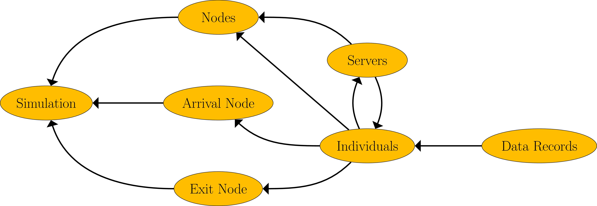

.. _code-structure:

===============
Strwythur y Cod
===============

Ciw is structured in an object orientated manor.

Y dosbarthau sy'n ffurfio Ciw yw:

- Simulation
- Arrival Node
- Exit Node
- Node
- Server
- Individual
- Data Record