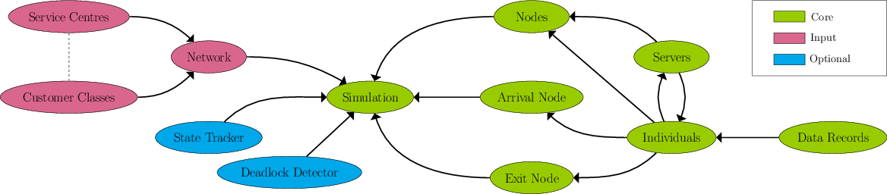

.. _code-structure:

===============
Strwythur y Cod
===============

Mae Ciw wedi'i strwythuro mewn o wrthrychau a dosbarthiadau.

Mae Ciw yn cynnwys 3 fath o wrthrych, Craidd, Mewnbwn, ac Opsiynnol.

Craidd:

- Simulation
- Arrival Node
- Exit Node
- Node
- Server
- Individual
- Data Record

Mewnbwn:

- Network
- Service Centre
- Customer Classe

Opsiynnol:

- State Tracker
- Deadlock Detector