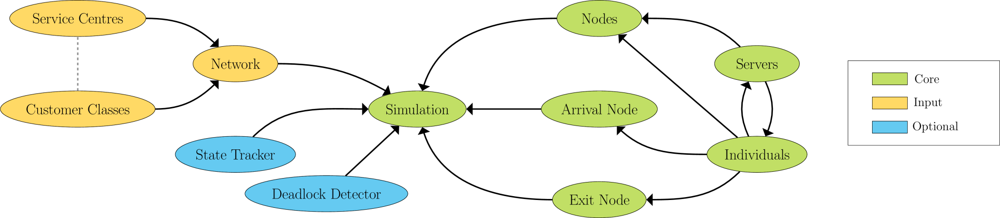

.. _code-structure:

===============
Strwythur y Cod
===============

Mae Ciw wedi'i strwythuro mewn ffordd gwrthrych-gyfeiriadol:

Mae gan Ciw tri math o wrthrych, Craidd, Mewnbwn, ac Opsiynol:

Craidd:

- Simulation
- Arrival Node
- Exit Node
- Node
- Server
- Individual

Mewnbwn:

- Network
- Service Centre
- Customer Classe

Opsiynol:

- State Tracker
- Deadlock Detector