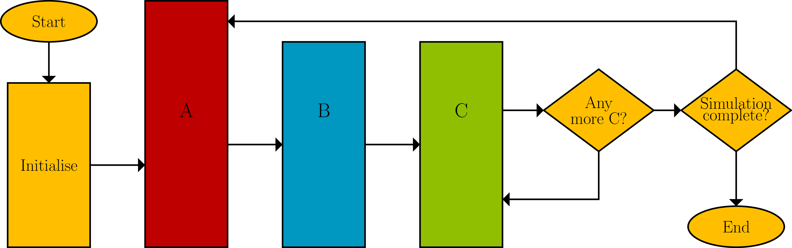

.. _three-phase:

===============
Y Dull Tri Cham
===============

Mae Ciw yn defnyddio'r dull tri cham safonol ar gyfer efelychiad digwyddiadau arwahanol.
Ciw makes use of the standard three phase simulation approach for discrete event simulations.

