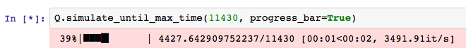

.. _progress-bars:

===========
Bar Cynnydd
===========

Ar gyfer un rhediad o'r efelychiad, gall Ciw dangos bar cynnydd. Mae hyn yn gallu helpu delweddu faint o'r rhediad efelychiad yna sydd eisoes wedi rhedeg. Er mwyn gweithredu hyn, ychwanegwch yr opsiwn :code:`progress_bar=True` i'r method :code:`simulate_until_max_time`:

    >>> Q.simulate_until_max_time(1500, progress_bar=True) # doctest:+SKIP

Mae'r delwedd isod yn dangos engrhaifft o'r allbwn:

