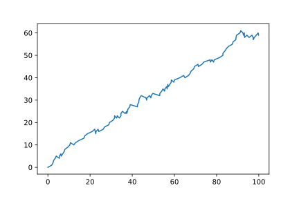
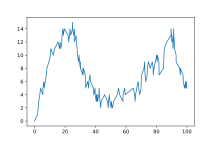

===========================
Nifer Newidol o Gweinyddion
===========================

Yn yr enghraifft hon byddwn yn ystyried rhwydwaith lle ychwanegwn neu dilewn gweinyddion yn dibynnu ar cyflwr y system.  Edrychwn ar system heb yr ymddygiad hwn yn gyntaf, ac yna'r system gyda'r ymddygiad dymunol, i'w gymharu.

Heb yr ymddygiad dymunol
~~~~~~~~~~~~~~~~~~~~~~~~

Ystyriwch ciw M/M/1 gyda :math:`\Lambda = 1` ac :math:`\mu = 0.4`. Fan hyn mae'r dwysedd traffig yn fwy nag un, hynny yw mae cwsmeriaid yn cyrraedd yn gyflymach na gallen nhw cael eu gwasanaethu, ac felly bydd y maint ciw yn cynyddu dros amser. Gadewch i ni weld hwn::

    >>> import ciw

    >>> N = ciw.create_network(
    ...     arrival_distributions=[ciw.dists.Exponential(1)],
    ...     service_distributions=[ciw.dists.Exponential(0.4)],
    ...     number_of_servers=[1]
    ... )
    
    >>> ciw.seed(0)
    >>> Q = ciw.Simulation(N, tracker=ciw.trackers.SystemPopulation())
    >>> Q.simulate_until_max_time(100)

Nawr plotiwn poblogaeth y system dros amser::

    >>> plt.plot(
    ...     [row[0] for row in Q.statetracker.history],
    ...     [row[1] for row in Q.statetracker.history]
    ... ); # doctest:+SKIP

Gyda'r ymddygiad dymunol
~~~~~~~~~~~~~~~~~~~~~~~~

Nawr byddwn yn creu :code:`AdaptiveNode` a fydd yn ychwanegu dau gweinydd os yw'r poblogaeth yn mynd yn fwy na 10 unigolyn, and yna disgyn yn ôl i un gweinydd os yw'r poblogaeth yn disgyn yn ôl i dri unigolyn.
Yn gyntaf creuwn y :code:`AdaptiveNode` sy'n eitfeddu o'r dosbarth :code:`ciw.Node`, ac yn trosysgrifennu'r dull :code:`have_event` fel ei bod yn gwirio'r maint poblogaeth ac yn ychwanegu / dileu gweinyddion fel sydd angen::

    >>> class AdaptiveNode(ciw.Node):
    ...     def have_event(self):
    ...         if (len(self.all_individuals) > 10) and (len(self.servers) == 1):
    ...             print(f'Adding servers at {self.get_now():.3f}')
    ...             self.add_new_servers(2)
    ...         elif (len(self.all_individuals) < 4) and (len([s for s in self.servers if not s.offduty]) == 3):
    ...             print(f'Removing servers at {self.get_now():.3f}')
    ...             self.take_servers_off_duty()
    ...             self.add_new_servers(1)
    ...         super().have_event()

Fan hyn rydym wedi ychwanegu datganiadau print er mwyn recordio pryd mae'r newidiadau mewn niferoedd gweinyddion yn digwydd.

Nawr ail-rhedwn yr un system, yn dweud wrth Ciw i defnyddio'r :code:`node_class` newydd.
We'll still begin with just one server::

    >>> ciw.seed(0)
    >>> Q = ciw.Simulation(N, node_class=AdaptiveNode, tracker=ciw.trackers.SystemPopulation())
    >>> Q.simulate_until_max_time(100)
    Adding servers at 12.279
    Removing servers at 43.344
    Adding servers at 89.848

Nawr plotiwn poblogaeth y system dros amser::

    >>> plt.plot(
    ...     [row[0] for row in Q.statetracker.history],
    ...     [row[1] for row in Q.statetracker.history]
    ... ); # doctest:+SKIP

Nawr gwelwn fod poblogaeth y system o dan rheolaeth gwell.
Ymhellach, mae'r newidiadau mawr ym mhoblogaeth y system yn tueddu digwydd ar yr amseroedd cafodd y weinyddion eu ychwanegu neu eu dileu.
