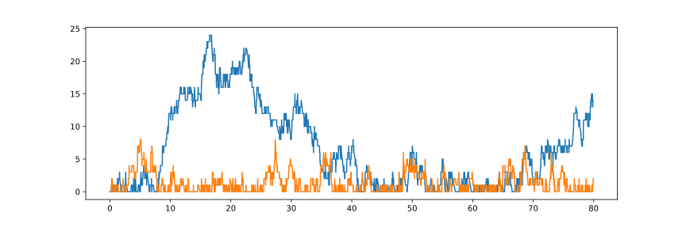
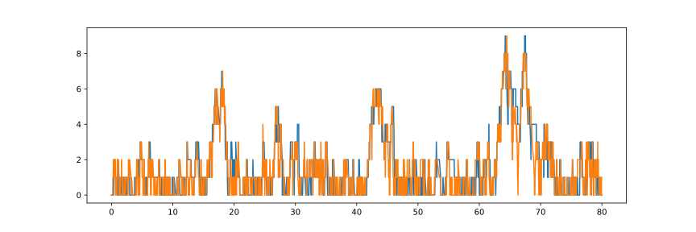

Trosglwyddiadau Cyflwr-dibynnol
===============================

Yn yr enghraifft hon ystyriwch rhwydwaith lle caiff cwsmeriaid eu cludo'n wahanol yn dibynnu ar cyflwr y system. Edrychwn ar system heb yr ymddygiad hwn yn gyntaf, ac yna'r system gyda'r ymddygiad dymunol, i'w gymharu.

Hen yr ymddygiad dymunol
~~~~~~~~~~~~~~~~~~~~~~~~

Ystyriwch y rhwydwaith tri nod canlynol, llae mae dyfodiadau ond yn digwydd yn y nod cyntaf, yna caiff cwsmeriaid eu trosglwyddo ar hap naill ai i'r 2il neu 3ydd nod cyn gadael::

    >>> import ciw

    >>> N = ciw.create_network(
    ...     arrival_distributions=[
    ...         ciw.dists.Exponential(10),
    ...         ciw.dists.NoArrivals(),
    ...         ciw.dists.NoArrivals()],
    ...     service_distributions=[
    ...         ciw.dists.Exponential(25),
    ...         ciw.dists.Exponential(6),
    ...         ciw.dists.Exponential(8)],
    ...     routing=[[0.0, 0.5, 0.5],
    ...              [0.0, 0.0, 0.0],
    ...              [0.0, 0.0, 0.0]],
    ...     number_of_servers=[1, 1, 1]
    ... )

Nawr rhedwn y system am 80 uned amser yn defnyddio traciwr cyflwr er mwyn tracio'r nifer o gwsmeriaid yn Nod 1 a Nod 2::

    >>> ciw.seed(0)
    >>> Q = ciw.Simulation(N, tracker=ciw.trackers.NodePopulation())
    >>> Q.simulate_until_max_time(80)
    
    >>> ts = [ts[0] for ts in Q.statetracker.history]
    >>> n2 = [ts[1][1] for ts in Q.statetracker.history]
    >>> n3 = [ts[1][2] for ts in Q.statetracker.history]

Trwy blotio `n2` ac `n2` gwelwn fod y nifer o gwsmeriaid ym mhob nod yn gwahanol iawn::

    >>> import matplotlib.pyplot as plt # doctest:+SKIP
    >>> plt.plot(ts, n2); # doctest:+SKIP
    >>> plt.plot(ts, n3); # doctest:+SKIP

Gyda'r ymddygiad dymunol
~~~~~~~~~~~~~~~~~~~~~~~~

Nawr crëwn :code:`CustomRouting` newydd ar gyfer Nod 1, a fydd yn anfon cwsmeriaid i'r nod lleiaf brysur allan o Nod 2 a 3.
Yn gyntaf crëwn :code:`CustomRouting` sy'n etifeddu o :code:`ciw.Node`, ac yn trosysgryfennu'r dull :code:`next_node`::

    >>> class CustomRouting(ciw.Node):
    ...     """
    ...     Yn dewis naill ai Nod 2 neu Nod 3 fel y nod gyrchfan,
    ...     pa bynnag un sydd a'r nifer lleiaf o gwsmeriaid. Yn dewis
    ...     ar hap rhwng y ddau os yw'r gyfartal.
    ...     """
    ...     def next_node(self, ind):
    ...         n2 = self.simulation.nodes[2].number_of_individuals
    ...         n3 = self.simulation.nodes[3].number_of_individuals
    ...         if n2 < n3:
    ...             return self.simulation.nodes[2]
    ...         elif n3 < n2:
    ...             return self.simulation.nodes[3]
    ...         return ciw.random_choice([self.simulation.nodes[2], self.simulation.nodes[3]])

Nawr ail-rhedwn yr un system, yn defnyddio'r un gwrthrych rhwydwaith :code:`N` (Nodwch ni fydd y matrix trosglwyddo yn cael ei ddefnyddio nawr).
Dywedwn wrth Ciw pa dosbarth nod i ddefnyddio ar gyfer pob nod o'r rhwydwaith, trwy rhoi'r dadl :code:`node_class` rhestr o ddosbarthau.
Defnyddiwn y dosbarth :code:`CustomRouting` newydd ar gyfer Nod 1, a'r dosbarth  arferol ar gyfer Nodau 2 a 3::

    >>> ciw.seed(0)
    >>> Q = ciw.Simulation(
    ...     N, tracker=ciw.trackers.NodePopulation(),
    ...     node_class=[CustomRouting, ciw.Node, ciw.Node])
    >>> Q.simulate_until_max_time(80)
    
    >>> ts = [ts[0] for ts in Q.statetracker.history]
    >>> n2 = [ts[1][1] for ts in Q.statetracker.history]
    >>> n3 = [ts[1][2] for ts in Q.statetracker.history]

Trwy blotio `n2` ac `n3` nawr, gwelwn fod y nifer o gwsmeriaid ym mhob nod yn dilyn eu gilydd yn agos, gan ein fod yn cydbwyso pa mor brysur yw'r nodau trwy pob amser llenwi'r nod lleiaf brysur::

    >>> plt.plot(ts, n2); # doctest:+SKIP
    >>> plt.plot(ts, n3); # doctest:+SKIP

