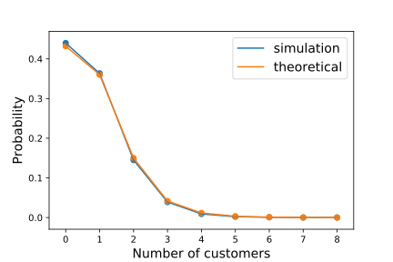

.. _processor-sharing:

==================================
Sut i Efelychu Rhannu Prosesyddion
==================================

Mae rhannu prosesyddion yn ddisgybliaeth gwasanaeth lle mae nifer o gwsmeriaid yn cael eu gwasanaethu ar yr un pryd, gyda 'llwyth y wasanaeth; yn cael ei rhannu'n gyfartal rhwng pob cwsmer sy'n  derbyn wasanaeth. Hynny yw, po fwyaf nifer o gwsmeriaid sy'n derbyn wasanaeth, po araf bydd y gwasanaeth. Mae cyflymder y gwasanaeth yn cael ei diweddaru'n parhaus trwy gydol gwasanaeth y cwsmer er mwyn gweld effaith dyfodiadau newydd a chwsmeriaid yn gadael y nod.

Er mwyn gweithredu hwn yn ciw, defnyddiwn dosbath :code:`Node` gwahanol, gan ddefnyddio'r dadl :code:`node_class` wrth creu'r gwrthrych :code:`Simulation`. Y dosbarth node sydd angen yw :code:`ciw.PSNode`.

Ystyriwch giw Markovaidd gyda cynhwysedd rhannu prosesyddion anfeidraidd (dynodir y cynhwysedd hwn gan y dadl :code:`number_of_servers` wrth creu'r gwrthrych :code:`Network`)::

    >>> import ciw
    >>> N = ciw.create_network(
    ...     arrival_distributions=[ciw.dists.Exponential(4)],
    ...     service_distributions=[ciw.dists.Exponential(9)],
    ...     number_of_servers=[float('inf')]
    ... )

Nawr crewn gwrthrych :code:`Simulation` gan ddefnyddio :code:`ciw.PSNode` yn hytrach na :code:`ciw.Node`::
    
    >>> ciw.seed(0)
    >>> Q = ciw.Simulation(N, node_class=ciw.PSNode)

Nodwch fod hwn yn gosod y node rhannu prosesyddion i bob nod yn y rhwydwaith.
Fel arall, gallwn rhoi rhestr o wahanol dosbarthau nod, i'w ddefnyddio ar gyfer pob nod wahanol y rhwydwaith (gweler :ref:`yr enghraifft hon <ps-routing>` ar gyfer enghraifft manwl o hwn)::

    >>> ciw.seed(0)
    >>> Q = ciw.Simulation(N, node_class=[ciw.PSNode])

Nawr rhedwn yr efelychiad nes i 1000 cwsmer pasio trwyddo::

    >>> Q.simulate_until_max_customers(1000)

Gadewch i ni edrych ar yr amser gwasanaeth cymedrig. Nawr, yn hytrach nag i'r amser gwasanaeth cymedrig fod :math:`\frac{1}{\mu} = \frac{1}{9}` fel byddwn yn disgwyl gyda ciwiau FIFO arferol, nawr byddwn yn disgwyl amser gwasanaeth cymedrig :math:`\frac{1}{\mu - \lambda} = \frac{1}{9-4} = \frac{1}{5}`::

    >>> recs = Q.get_all_records()
    >>> services = [r.service_time for r in recs if r.arrival_date > 50]
    >>> sum(services) / len(services)
    0.1935655...

Er ei fod yn edrych fel bod amseroedd gwasanaeth llawer yn hirach na chiw FIFO arferol, does dim amseroedd aros o gwbl. Bydd wedi cymryd yr union un faint o amser i brosesu pob 1000 cwsmer mewn ciw rhannu prosesyddion â mewn ciw FIFO, gan fod y disgybliaeth rhannu prosesyddion yn cadw-gwaith (*work-conserving*). Gadewch i ni weld::

    >>> ps_time_to_process_1000 = Q.current_time
    >>> ps_time_to_process_1000
    254.0556420...

    >>> ciw.seed(0) # same seed
    >>> Q = ciw.Simulation(N) # regular FIFO queue
    >>> Q.simulate_until_max_customers(1000)
    >>> fifo_time_to_process_1000 = Q.current_time
    >>> fifo_time_to_process_1000
    254.0556420...

Yn Ciw mae dau gwahanol cyffredinoliaethau o rhannu prosesyddion ar gae: rhannu prosesyddion cyfyngedig, a rhannu prosesyddion cynhwysedig, a ddisgrifir isod. Gallwch hefyd efelychu systemau sy'n profi y ddau ymddygiad hwn ar yr un pryd.

Rhannu Prosesyddion Cyfyngedig
------------------------------

Mae *ciw rhannu prosesyddion cyfyngedig* ([JZ09]_) yn gyffredinoldeb o giw rhannu prosesyddion, lle ond nifer penodol o gwsmeriad sy'n gallu rhannu'r llwyth gwasanaeth ar unrhyw adeg. Mae hwn yn golygu os oes mwy na'r nifer honno o gwsmeriaid yn bresenol yn y nod yn barod, bydd cwsmer newydd sy'  cyrraedd y nod angen aros mewn rhes mewn modd FIFO nes i'r nifer o gwsmeriaid sy'n rhannu'r llwyth gwasanaeth yn cwympo o dan y cyfwng a rhoddir.

Gyda ciwiau rhannu prosesyddion cyfyngedig, gallwn cyfyngu'r cynhwysedd rhannu.
Gallwn gwneud hwn trwy osod :code:`number_of_servers` yn yr wrthrych :code:`Network`.

Ystyriwch yr un system, ond gyda cyfwng o 3 cwsmer yn rhannu'r llwyth gwasanaeth ar yr un pryd::

    >>> N = ciw.create_network(
    ...     arrival_distributions=[ciw.dists.Exponential(4)],
    ...     service_distributions=[ciw.dists.Exponential(9)],
    ...     number_of_servers=[3]
    ... )
    >>> ciw.seed(0)
    >>> Q = ciw.Simulation(N, node_class=ciw.PSNode)
    >>> Q.simulate_until_max_customers(1000)

Gallwn gwirio nifer o gwsmeriaid yn bresenol yn y nod as gyfer rheini oedd angen aros a rheini nad oedd angen aros::

    >>> recs = Q.get_all_records()
    >>> max([r.queue_size_at_arrival for r in recs if r.waiting_time == 0.0])
    2
    >>> min([r.queue_size_at_arrival for r in recs if r.waiting_time > 0.0])
    3

Gwelwn ar gyfer pob cwsmer oedd angen aros, arhoson nhw oherwydd roess o leiaf 3 cwsmer yn bresenol yn y nod pan gyrrhaeddon nhw.

Rhannu Prosesyddion Cynhwysedig
-------------------------------

Mae *ciw rhannu prosesyddion cynhwysedig*, neu ciw R-PS ([XL09]_), yn gyffredinoldeb arall o ciw rhannu prosesyddion.
Mae ganddo paramedr :math:`R`, trothwy lle os yw'r nifer o gwsmeriaid yn mynd yn fwy nag e, mae'r gwasanaeth yn troi i mewn i ddisgybliaeth rhannu prosesyddion rhwng :math:`R` prosesydd. Hynny yw, pan mae :math:`R` neu llai o gwsmeriaid, mae pob cwsmer yn cael ei weini'n annibynnol gyda chyfradd 1l pan mae :math:`n > R` cwsmer, mae pob cwsmer yn cael ei weini gyda chyfradd :math:`R/n`.

Mewn ciwiau rhannu prosesyddion cynhwysedig, gallwn osod y trothwy :math:`R` trwy osod :code:`ps_threshold` yn yr wrthrych :code:`Network`.

Ystyriwch system arall, gyda trothwy o 3 cwsmer cyn mae angen rhannu prosesyddion::

    >>> N = ciw.create_network(
    ...     arrival_distributions=[ciw.dists.Exponential(10)],
    ...     service_distributions=[ciw.dists.Exponential(12)],
    ...     number_of_servers=[float('inf')],
    ...     ps_thresholds=[3]
    ... )
    >>> ciw.seed(0)
    >>> Q = ciw.Simulation(N, node_class=ciw.PSNode,
    ...     tracker=ciw.trackers.SystemPopulation())
    >>> Q.simulate_until_max_time(1000)

Ychwanegon ni traciwr cyflwr er mwyn cymharu'r dosraniad cyflwr i ddamcaniaeth::

    >>> Q.statetracker.state_probabilities(observation_period=(100, 900)) # doctest:+SKIP
    {0: 0.4398895319845431,
     1: 0.36347562618363427,
     2: 0.14507848814897362,
     3: 0.03916266222272885,
     4: 0.009173532615323427,
     5: 0.0021859853488494707,
     6: 0.0008073744011269568,
     7: 9.470825328580901e-05,
     8: 0.00013209084153452012}

Yn [XL09]_ rhoddir canlyniadau damcaniaethol ar gyfer y tebygolrwyddau hyn gan:

.. math::
    p(j) = \begin{cases}
            \frac{(1-\rho)\frac{R!}{j!}(R\rho)^{j-R}E_2(R,R\rho)}{1-E_2(R,R\rho) \rho^{N-R}\rho}, & j <R\\
            \frac{E_2(R,R\rho)\rho^{j-R}(1-\rho)}{1-E_2(R,R\rho)\rho^{N-R}\rho}, & N\ge j \ge R
        \end{cases}

lle :math:`R` yw'r cynhwysedd rhannu prosesyddion, :math:`\rho = \frac{\lambda}{R\mu}` yw'r dwysedd traffig, ac :math:`E_2` yw'r ffwythiant Erlang y rhoddir gan:

.. math::
    E_2(R, A) = \frac{
    \frac{A^R}{R!} \cdot \frac{R}{R-A}
    }{
    \left(\frac{A^R}{R!} \cdot \frac{R}{R-A}\right) + \sum_{i=0}^{R-1}\frac{A^i}{i!}
    }

Mae plotio'r canlyniadau damcaniaeth yn erbyn un treial o'n efelychiad yn dangos cyfliniad dda:

