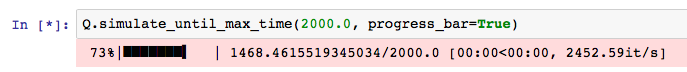

.. _progress-bar:

======================
Sut i Gael Bar Cynnydd
======================

Ar gyfer un rhediad efelychiad, gall Ciw galluogi bar cynnydd ymddangos.
Mae hwn yn helpu delweddu pa mor bell trwy'r rhediad yw'r efelychiad.
Gall galluogi bar cynnydd wrth ddefnyddio'r dulliau :code:`simulate_until_max_time` a :code:`simulate_until_max_customers`.
I weithredu hwn, ychwanegwch yr opsiwn :code:`progress_bar=True`.

Enghraifft gan ddefnyddio'r dull :code:`simulate_until_max_time`::

    >>> Q.simulate_until_max_time(2000.0, progress_bar=True) # doctest:+SKIP

Mae'r ddelwedd isod yn dangos esiampl o'r allbwn:

Enghraifft gan ddefnyddio'r dull :code:`simulate_until_max_customers`::

    >>> Q.simulate_until_max_customers(20000, progress_bar=True) # doctest:+SKIP

Mae'r ddelwedd isod yn dangos esiampl o'r allbwn:

.. image:: ../_static/progress_bar_customers.png
   :scale: 100 %
   :alt: Allbwn bar cynnydd (simulate_until_max_customers).
   :align: center