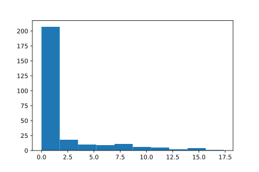

.. _tutorial-iii:

=================================
Tiwtorial III: Casglu Canlyniadau
=================================

Yn y tiwtorialau diwethaf gwnaethon ni diffinio ac efelychu banc am ddiwrnod, a gwelon ni sut i mynedu rhannau o'r injan efelychu::

    >>> import ciw
    >>> N = ciw.create_network(
    ...     arrival_distributions=[ciw.dists.Exponential(0.2)],
    ...     service_distributions=[ciw.dists.Exponential(0.1)],
    ...     number_of_servers=[3]
    ... )
    >>> ciw.seed(1)
    >>> Q = ciw.Simulation(N)
    >>> Q.simulate_until_max_time(1440)

Yn cloi, gallwn ni cael rhestr o'r holl gofnodion data a chasglwyd gan holl gwsmeriaid a gorffennodd o leiaf un gwasanaeth, gan ddefnyddio'r dull :code:`get_all_records` o'r gwrthrych Simulation::

    >>> recs = Q.get_all_records()

Mae hwn yn rhoi rhestr o tuples enwedig.
Mae pob tuple yn cynnwys y wybodaeth ganlynol:

    - :code:`id_number`
    - :code:`customer_class`
    - :code:`node`
    - :code:`arrival_date`
    - :code:`waiting_time`
    - :code:`service_start_date`
    - :code:`service_time`
    - :code:`service_end_date`
    - :code:`time_blocked`
    - :code:`exit_date`
    - :code:`destination`
    - :code:`queue_size_at_arrival`
    - :code:`queue_size_at_departure`

Roddir mwy o wybodaeth ar bob un o rain yn :ref:`refs-results`.

Gan ddefnyddio cyfansoddiad rhestrau, gallwn ni cael rhestrau o ba bynnag ystadegyn a hoffwn::

    >>> # Rhestr o amseroedd wasanaeth
    >>> servicetimes = [r.service_time for r in recs]
    >>> servicetimes
    [2.94463..., 5.96912..., 18.80156..., ..., 33.18376...]

    >>> # Rhestr o'r amseroedd aros
    >>> waits = [r.waiting_time for r in recs]
    >>> waits
    [0.0, 0.0, 0.0, 0.20439..., ..., 0.0]

Nawr fe allwn gael ystadegau cryno trwy drin y rhestrau yma::

    >>> mean_service_time = sum(servicetimes) / len(servicetimes)
    >>> mean_service_time
    10.647482...

    >>> mean_waiting_time = sum(waits) / len(waits)
    >>> mean_waiting_time
    4.230543...

Rydym nawr yn gwybod yr amser aros cymedrig y cwsmeriaid!
Yn y tiwtorial nesaf fe fyddwn yn dangos sut i gael canlyniadau mwy cynrychioliadol (oherwydd fe efelychon ni am un diwrnod penodol yn unig fan hyn).

Gan ddefnyddio llyfrgelloedd arall gallwn dderbyn ystadegau cryno pellach.
Rydyn ni yn awgrymu `numpy <http://www.numpy.org/>`_, `pandas <http://pandas.pydata.org/>`_ a `matplotlib <http://matplotlib.org/>`_. 
Mae'r rhain yn rhoi'r gallu i archwilio ystadegau arall, a phlotio.
Crëwyd yr histogram o amseroedd aros isod gan ddefnyddio matplotlib, yn defnyddio'r cod canlynol::

    >>> import matplotlib.pyplot as plt # doctest:+SKIP
    >>> plt.hist(waits); # doctest:+SKIP

Os hoffwch chi weld pa mor brysur neu segur mae'r gweinyddion wedi bod trwy rediad yr efelychiad, gallwn edrych ar :code:`server_utilisation` y nod.
Hwn yw defnydd cymedrig pob gweinydd, sy'n hafal i faint o amser roedd y gweinydd yn brysur (gyda chwsmer), wedi rhannu gyda chyfanswm yr amser roedd y gweinydd ar ddyletswydd::

    >>> Q.transitive_nodes[0].server_utilisation
    0.75288...

Felly yn ein banc, ar gyfartaledd roedd y gweinyddion yn brysur 75.3% o'r amser.

Yn y tiwtorial nesaf dangoswn ni sut i ddefnyddio Ciw i gael canlyniadau dibynadwy, ac o'r diwedd ffeindio'r amser aros cymedrig ar gyfer y banc.